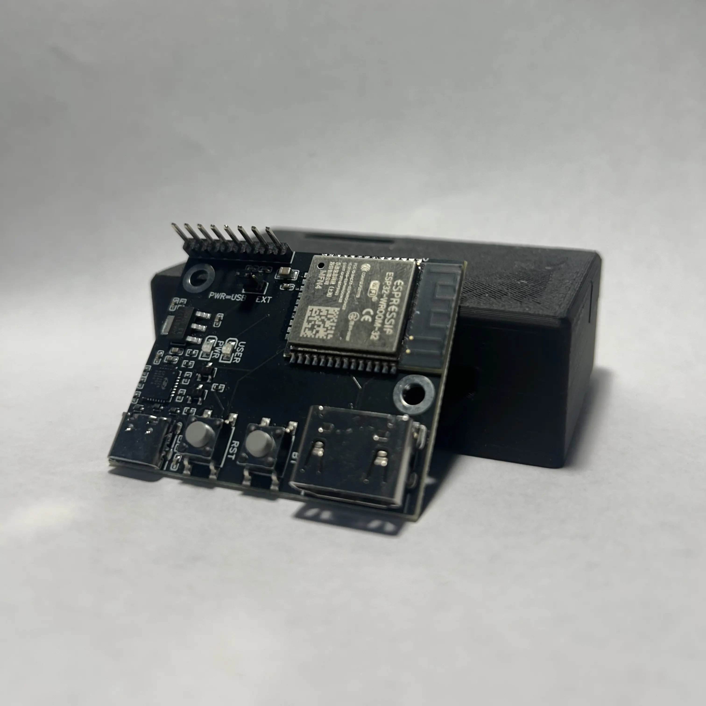
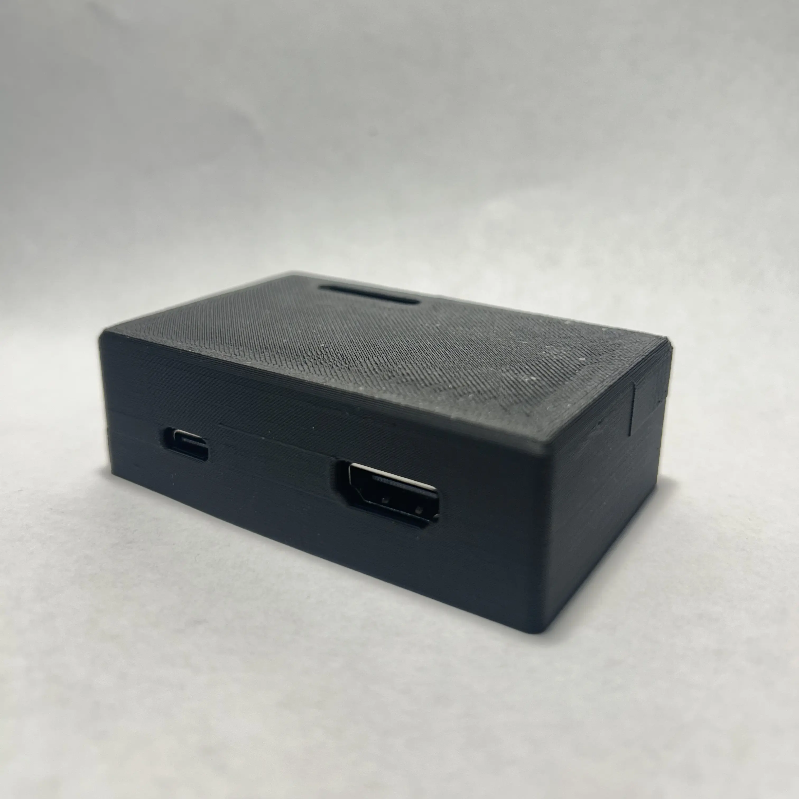
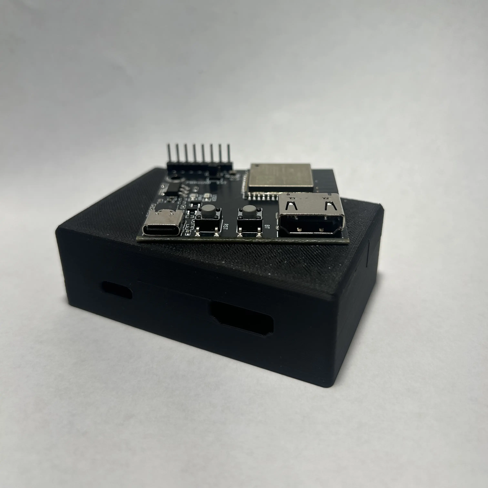

<h1 align="center">HardwareDDC</h1>
<h4 align="center">A custom PCB that makes adjusting monitor settings easy and convenient</h4>

<!-- Horizontal layout with 3 images -->

  
  
  

## What is DDC?

DDC/CI (Display Data Channel Command Interface) lets you control monitors with software instead of navigating the nipple or rear buttons. In a perfect world, we could control all monitors with DDC, but unfortunately, that's not the case...

- Some monitors simply don't support DDC :(
- Some monitors like Samsung's G9 ultrawides support DDC only on HDMI
- \*nix (i.e. macOS & Linux) users of DisplayLink don't have DDC support
- Your monitor only supports DDC through HDMI (not DisplayPort)

If you're in one of those last three situations HardwareDDC might be for you! It uses an ESP32 to send raw I2C DDC signals to your monitor's HDMI port while another port is used for video.

## Getting Started

HardwareDDC features an ESP32 with reset and boot buttons, an HDMI connector exposing GND, SDA and SCL, and it's powered by USB-C which also exposes the UART console. Optionally, it can be powered by 5V directly through the GPIO pins, and additional GPIO pins are available for debugging and future expandability.

The PCB and the 3D printed ABS case are available on the [website](https://hardwareddc.alexandreboutoille.com), and the files can be found [here](./hardware/README.md).

Once you have your board, you can flash the firmware with the [web installer](https://hardwareddc.alexandreboutoille.com).

Controlling HardwareDDC is done through hotkeys, instructions can be found [here](./ui/README.md)

---

## Sponsors

  

Thank you PCBWay for sponsoring this project providing PCB prototyping <3

## Future Ideas

- [x] Improve Microsoft Windows UX/Create Proper User Interface
  - [ ] Add more information to GUI (e.g. connection status)
  - [ ] Enable user-modifiable hotkeys
- [ ] Support Multiple Monitors
- [ ] Convert DisplayPort to VGA for a non-network-based approach

## Extras

Shoutout to these projects that make HardwareDDC possible:

- [ESP Web Tools](https://github.com/esphome/esp-web-tools)
- [Improv Wi-Fi](https://github.com/jnthas/Improv-WiFi-Library)
- [DDC/CI VCP library](https://github.com/tttttx2/ddcvcp)
