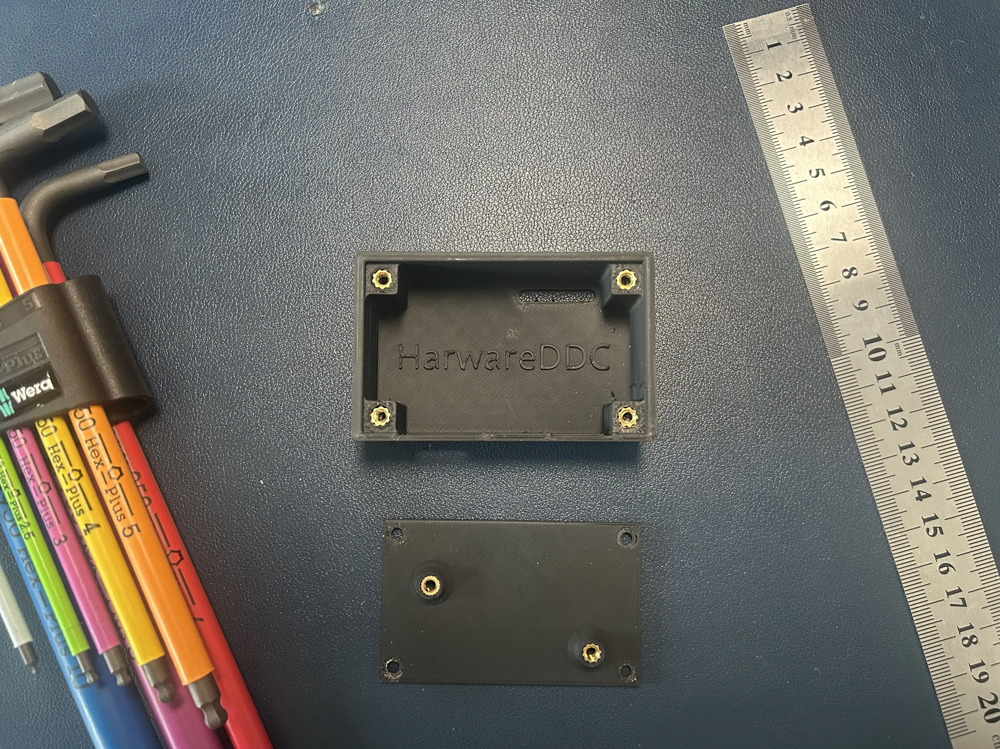
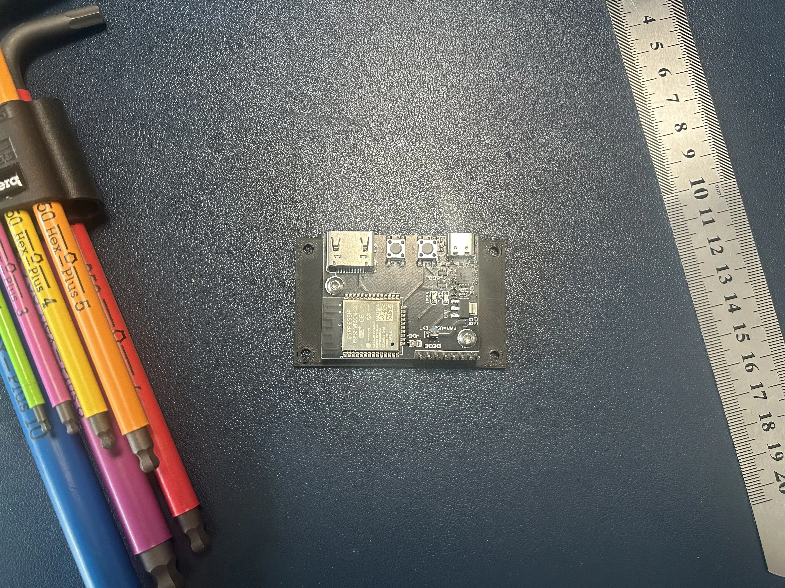
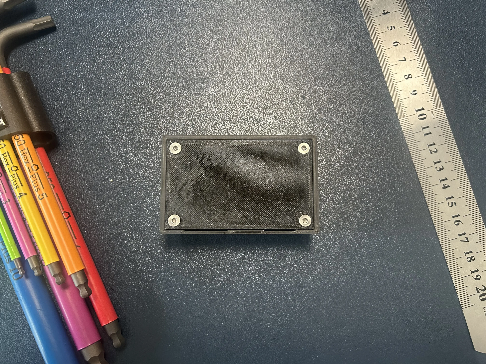

# Hardware

HardwareDDC comes with an optional two-part 3D-printed case which you can re-print yourself.

## BOM:

| Quantity | Description                               |
| -------- | ----------------------------------------- |
| 4        | M3x4x5 Heat set insert (the "Voron ones") |
| 2        | M3x6 BHCS                                 |
| 4        | M3x6 FHCS                                 |
| 1        | [Printed parts](./case/)                  |

## Print settings:

_it doesn't matter that much, but it's what I used_

- Layer height: 0.2mm
- Extrusion width: 0.4mm
- Infill: 20%
- Walls: 4
- Top/bottom layers: 5
- No supports
- Material: Board gets warm so I used ABS, but PLA should work

## Assembly:

### Step 1: Add Heatset Inserts

- 4 x Heat Set Insert

 

### Step 2: Place PCB

- 2 x M3x6 BHCS

_Make sure fasteners are centered in the board holes (future revision will reduce the tolerance)_

 

### Step 3: Close Case

- 4 x M3x6 FHCS

 

_The PCB is not yet fully open-source, however the schematic can be found [here](./pcb/HardwareDDC_rev1.0_schematic.pdf.pdf)_
